초심자를 위한 GitHub 메뉴얼
===========================

 이 메뉴얼은 깃헙을 사용하여 여러 사람들과 협업하기 위해 필요한 최소한의
기능만을 간략하게 소개합니다.

> 이 메뉴얼은 독자가 이미 git의 기본적인 사용법을 알고 있다고 가정하고
> 작성되었습니다.


목차
----

1. [혼자서 작업하기](#1)
    1. [저장소 만들기](#1-1)
    2. [로컬로 가져오기](#1-2)
    3. [수정사항을 깃헙 저장소에 반영하기](#1-3)
2. [다른사람 저장소에 기여하기](#2)
    1. [저장소 포크하기](#2-1)
    2. [로컬로 가져오기](#2-2)
    3. [수정사항을 내 깃헙 저장소에 반영하기](#3-3)
3. [다른사람의 도움을 받기](#3)
    1. [PR받기](#3-1)
    2. [Collaborator 추가하기](#3-2)


1 혼자서 작업하기
-----------------
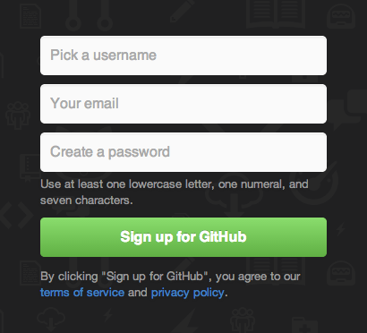

 로그인이 안된 상태일 때는 메인 페이지에서 바로 회원가입 폼이 나옵니다.
다음의 폼을 작성하여 회원가입을 하거나, 이미 깃헙에 가입이 되어있다면
우측 상단의 `Sign in` 버튼을 눌러서 로그인을 합니다.


### 1-1 저장소 만들기
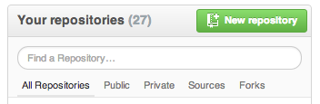

로그인이 된 상태라면 메인 페이지의 우측에 위와 같은 란이 있습니다.
`New repository` 버튼을 눌러서 저장소를 만듭니다.

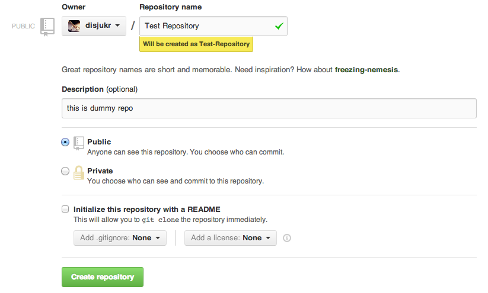

__Owner__: 어떤 계정에 저장소를 만들지 지정하는 란입니다.
다른 Organization에 가입되어있지 않다면
어차피 자기 자신만 선택이 가능하니 넘어갑니다.

__Repository name__: 저장소의 이름을 입력합니다.
띄어쓰기 등은 자동으로 `-`(하이픈)으로 변환이 되며
`Owner`가 갖고있는 저장소들과 겹치는 이름은 사용할 수 없습니다.

__Description__: 프로젝트에 대한 설명을 간략하게 적습니다.
optional 필드이기 때문에 굳이 입력하지 않아도 됩니다.

__Public / Private__: 저장소를 공개 저장소로 만들지 비공개 저장소로 만들지를
선택합니다. private 저장소를 이용하려면 달마다 돈을 지불해야 합니다.

__Initialize this repository with a README__: `master` 브랜치의 첫 커밋으로
`README.md` 파일을 담아 저장소를 생성합니다. `.gitignore` 파일과 `LICENSE`
파일을 같이 담을 수 있습니다.
로컬 저장소를 먼저 만들어놓은 경우에는 가급적 선택하지 않도록 합니다.

항목을 다 작성하였으면 `Create repository` 버튼을 눌러 저장소를 생성합니다.


### 1-2 로컬로 가져오기

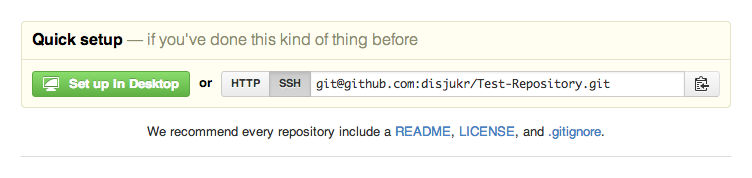

README를 추가하지 않고 저장소를 만들면 위와 같은 UI가 뜹니다.
README를 추가한 경우에는 페이지의 우측 하단에서
저장소 주소를 복사할 수 있습니다.
깃헙 클라이언트를 사용하는 경우에는 `Set up in Desktop` 혹은
`Clone in Desktop` 버튼을 클릭하면 되고,
커맨드라인 환경에서 git을 직접 사용하는 경우에는 위의 주소를 복사하여
다음과 같이 클론을 받으면 됩니다.

```sh
git clone git@github.com:disjukr/Test-Repository.git
```

README를 추가하지 않은 경우에는 다음과 같이 로컬 저장소에 깃헙 저장소를
원격 저장소로 등록하여 기존 작업이력을 올릴 수 있습니다.

```sh
git init
#현재 폴더를 저장소로 만든 다음,
git remote add origin git@github.com:disjukr/Test-Repository.git
#깃헙 저장소를 origin으로 등록
```


### 1-3 수정사항을 깃헙 저장소에 반영하기

자신의 깃헙 저장소가 `origin`으로 등록이 되어있다면 다음과 같이
`master` 브랜치의 수정사항을 저장소에 반영할 수 있습니다.

```sh
git push origin master
```


2 다른사람 저장소에 기여하기
----------------------------
깃헙에서는 다른 사람의 저장소에 코드를 기여하는 방법이 두 가지 있습니다.

1. 저장소를 포크한 다음 PR(Pull Request) 보내기
2. collaborator가 되기

PR은 자신이 작성한 패치를 저장소에 반영해달라고
프로젝트 파운더에게 요청하는 것입니다.
저장소에 직접 커밋을 반영할 수 있는 권한이 없다면 PR을 보내야 합니다.
collaborator는 프로젝트 파운더가 아니라도 프로젝트에 직접
커밋을 반영할 수 있는 사람을 의미합니다.
collaborator가 되기 위해서는 먼저 프로젝트 파운더의
신뢰를 얻을 필요가 있습니다.
신뢰를 얻기 위해서는 잘 작성된 패치를 PR하고
이슈 트래커에 활발하게 참여하는 등의 노력이 필요합니다.


### 2-1 저장소 포크하기

포크는 저장소를 자신이 권한을 가진 계정으로 복사해오는 것을 의미합니다.
PR을 보내려면 우선 해당 저장소를 포크해야 합니다.

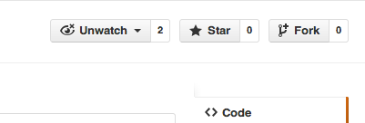

포크할 저장소의 우측 상단에 있는 Fork 버튼을 누르면,

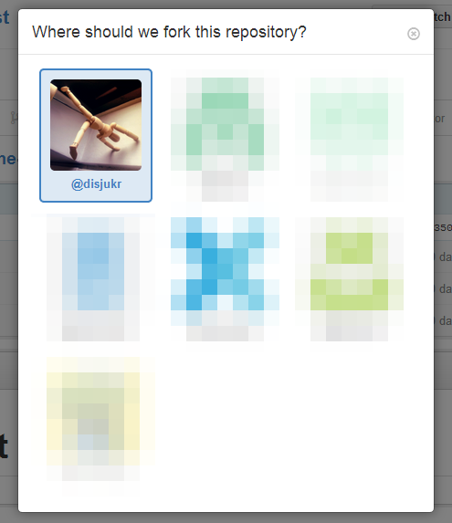

자신의 계정 및 가입한 organization 들의 목록이 뜹니다.
여기서 포크해올 계정을 클릭하면,


위와 같은 이미지가 뜨면서 포크가 진행됩니다.


### 2-2 로컬로 가져오기

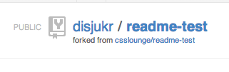

포크가 끝나면 자신의 계정에 해당 저장소가 추가됩니다.
이 곳에는 원하는대로 커밋을 푸시할 수 있습니다.

저장소를 로컬로 클론하는 방법은 [1-2](#1-2)와 같습니다.


### 2-3 수정사항을 "내" 깃헙 저장소에 반영하기

보통 자신의 저장소를 가르키는 remote 이름은 `origin`으로 짓고,
원본 저장소는 `upstream`이라고 붙입니다.

자신이 해당 프로젝트의 collaborator라면
바로 `upstream`으로 푸시할 수 있습니다.

만약 `upstream`에 새로운 커밋이 추가되었는데 자신의 저장소에
아직 반영이 안되었다면 다음과 같이 수정내역을 반영할 수 있습니다.
```sh
git pull upstream master
#upstream의 master 브랜치를 받아온 뒤,
git push origin master
#origin/master에 반영
```


### 2-4 PR 보내기

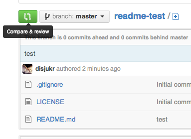

초록색 `Compare & review` 버튼을 누르면 다음과 같이
`upstream`과 `origin`의 수정사항을 비교해주는 화면이 나옵니다.

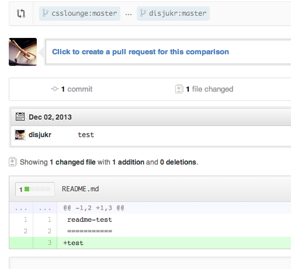

여기서 파란색 글씨로 써있는
`Click to create a pull request for this comparison` 이 부분을 클릭하면

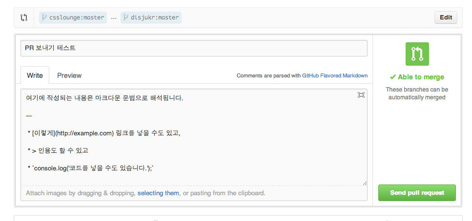

위와 같은 화면이 나옵니다.
자신이 어떤 부분을 수정했는지에 대한 설명을 작성하면 됩니다.

`Preview` 버튼을 누르면 다음과 같이 어떻게 렌더링될지 확인할 수 있습니다.

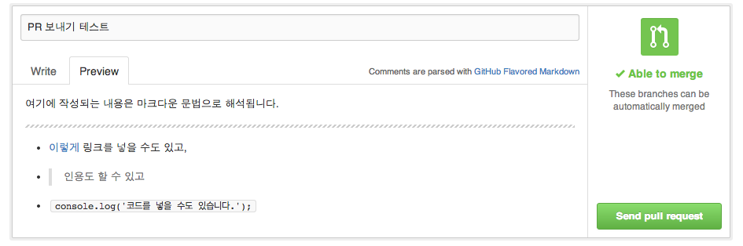

설명을 다 적었으면 `Send pull request` 버튼을 눌러서 PR을 보냅니다.

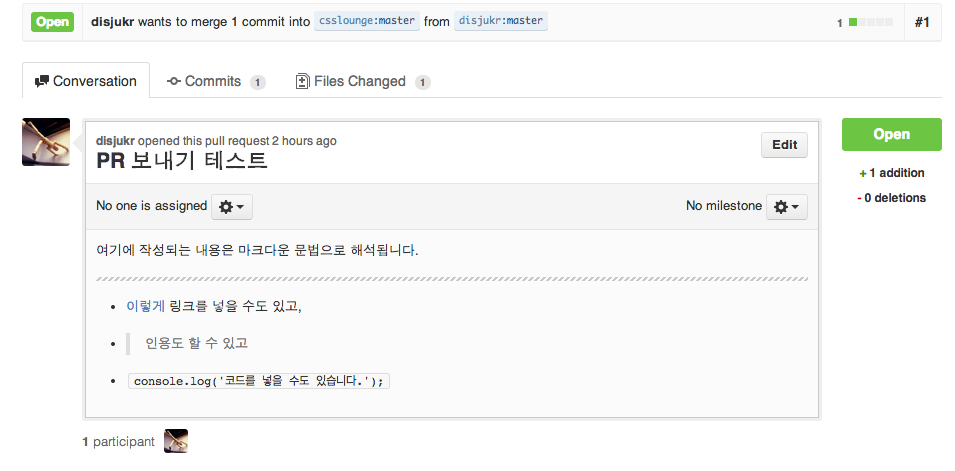


3 다른사람의 도움을 받기
------------------------

### 3-1 PR받기

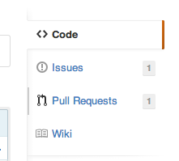

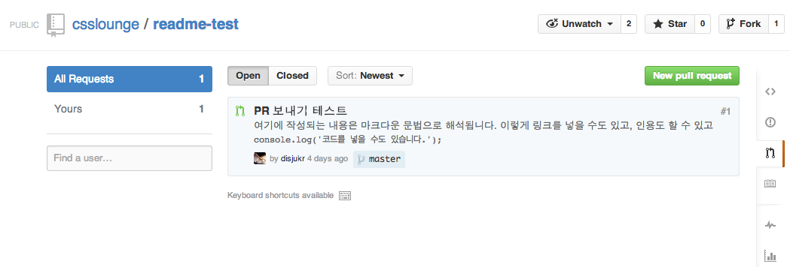

프로젝트에 쌓인 PR을 확인하려면 저장소 페이지의 우측에 있는
`Pull Requests` 탭에서 확인할 수 있습니다.

PR도 하나의 이슈로 취급되기 때문에 이슈트래커에서도 PR을 확인할 수 있으며,
merge를 승인하지 않고 그냥 PR을 닫을 수도 있습니다.

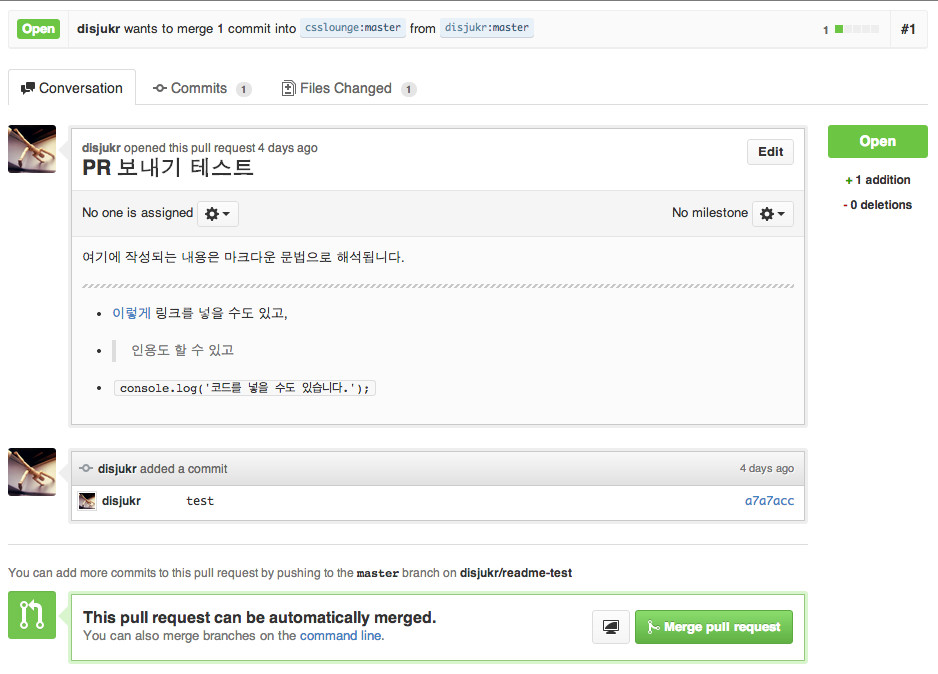

`Commits`버튼을 눌러서 커밋 목록을 확인할 수 있고
`Files Changed`를 눌러서 변경사항을 확인할 수 있습니다.

`Merge pull request` 버튼을 누르고,

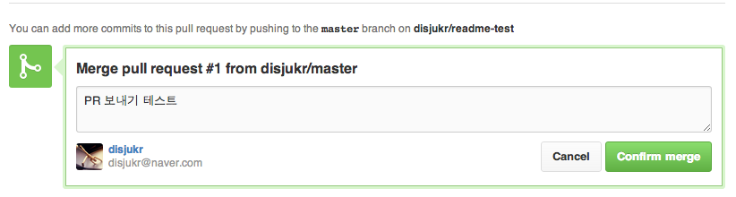

커밋 메세지를 작성한 다음 `Confirm merge` 버튼을 누르면


위와 같이 해당 패치가 프로젝트 저장소에 반영됩니다.


### 3-2 Collaborator 추가하기

PR을 받아주다 보면 신뢰할 수 있는 사람인가를 어느정도 구별할 수 있게 됩니다.
그런 사람에게는 프로젝트를 관리할 권한을 줄 수 있는데
그 것을 collaborator라고 합니다.

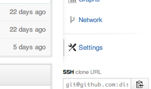

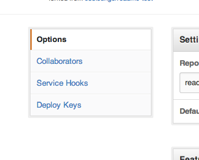

`Settings`/`Collaborators`탭으로 들어가서

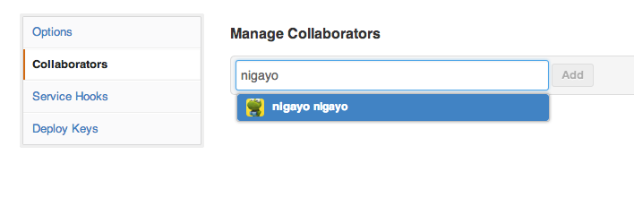

추가할 사람을 입력하고 `Add` 버튼을 누르면


위와 같이 collaborator가 추가됩니다.
